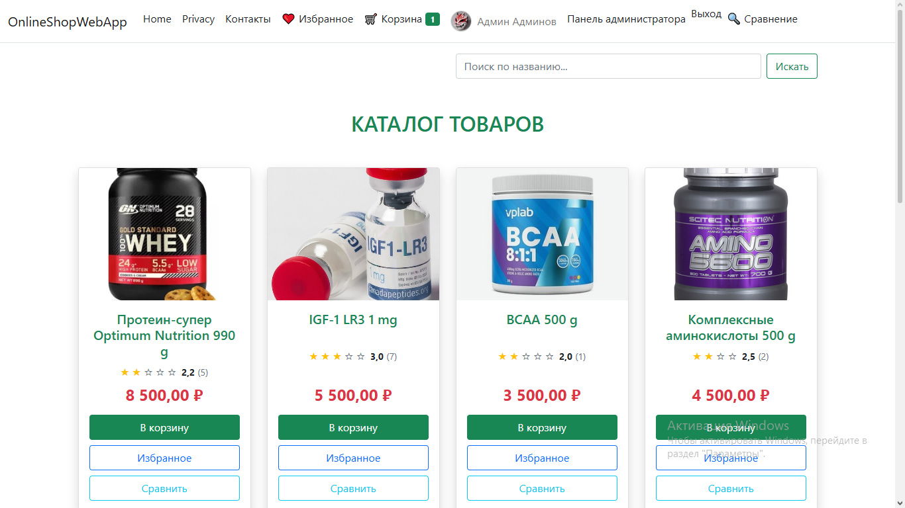
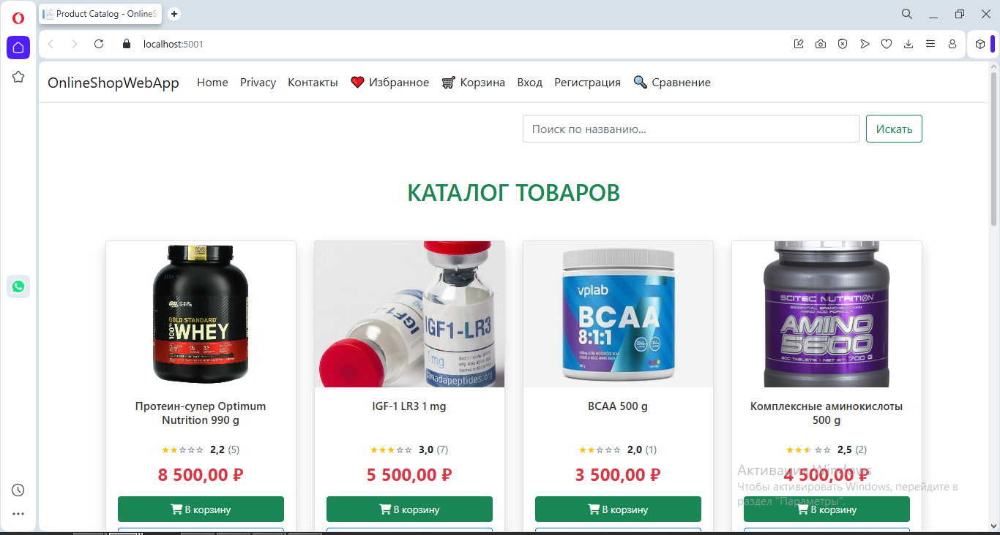
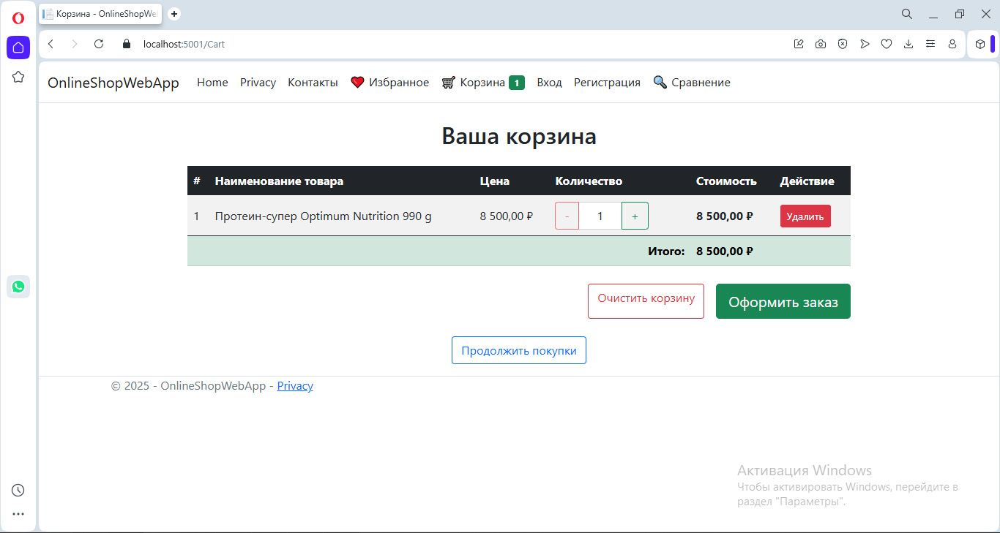
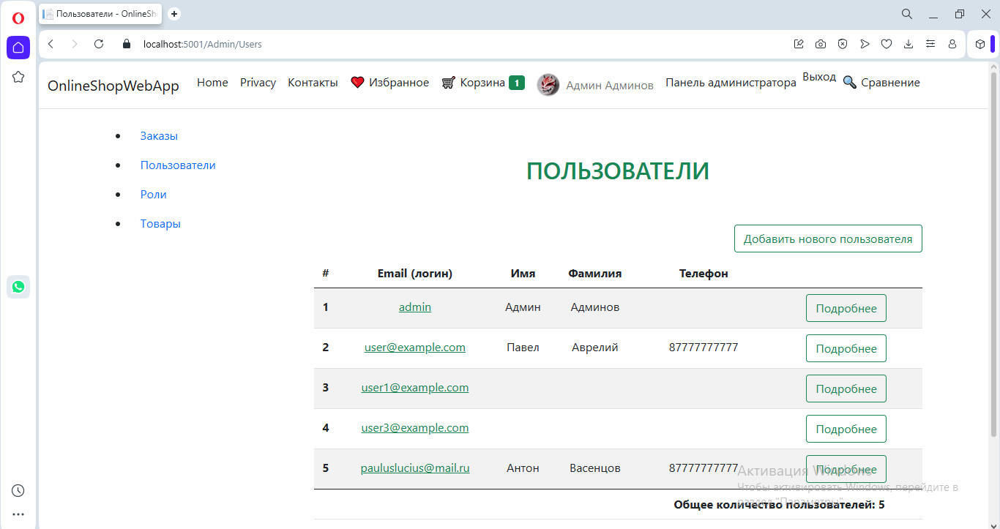

# 🛒 OnlineShop — учебный интернет-магазин на ASP.NET Core MVC

<div align="center">
  
  <br>
  <sub>Полноценный веб-сайт интернет-магазина с корзиной, избранным, заказами и админ-панелью</sub>
</div>

---

## 📂 Содержание
- [О проекте](#-о-проекте)
- [Архитектура репозитория](#-архитектура-репозитория)
- [Ключевые возможности](#-ключевые-возможности)
- [Технологический стек](#-технологический-стек)
- [Архитектурные решения и примеры кода](#-архитектурные-решения-и-примеры-кода)
- [Демонстрация](#-демонстрация)
- [Запуск проекта](#-запуск-проекта)
- [Контакты](#-контакты)

---

## 🏛️ О проекте

<div align="center">
  <sub><i>Для HR: кратко и по делу</i></sub>
</div>

**OnlineShop** — это учебный проект, созданный в рамках курса по ASP.NET Core. Он представляет собой полнофункциональный интернет-магазин с корзиной, избранным, сравнением товаров, оформлением заказов, личным кабинетом и админ-панелью. Проект демонстрирует навыки работы с ASP.NET Core MVC, Entity Framework Core, ASP.NET Core Identity, а также реализацию сложной бизнес-логики с помощью паттернов CQRS и MediatR. Кроме того, он интегрируется с отдельным микросервисом отзывов, что показывает понимание микросервисной архитектуры.

<div align="center">
  <sub><i>Для техлидов и разработчиков: технические детали</i></sub>
</div>

Проект построен на многослойной архитектуре с чётким разделением ответственности:
- **OnlineShop.Core** — модели предметной области, интерфейсы репозиториев, DTO, команды и запросы CQRS.
- **OnlineShop.Db** — реализация репозиториев, контекст базы данных, миграции, обработчики CQRS (с использованием MediatR).
- **OnlineShopWebApp** — MVC-приложение, содержащее контроллеры, представления Razor, вспомогательные сервисы (`ReviewsApiService`, `GuestDataMigrator`), хелперы для маппинга и работы с идентификатором пользователя.

Основные архитектурные решения:
- **CQRS и MediatR** — все операции с товарами (создание, редактирование, удаление, получение) реализованы через команды и запросы, что обеспечивает единую точку входа и упрощает тестирование.
- **Репозитории** — абстрагируют доступ к данным, позволяя легко менять источник (например, перейти с JSON-файлов на БД).
- **Кеширование** — через интерфейс `ICacheService` (реализация на Memcached) для часто запрашиваемых данных (список товаров, товар по ID).
- **Миграция данных гостя** — сервис `GuestDataMigrator` при входе пользователя переносит его корзину, избранное и сравнение из сессии в постоянную учётную запись.
- **Интеграция с микросервисом** — через `HttpClient` и сервис `ReviewsApiService` с автоматической авторизацией (JWT).

---

## 📂 Архитектура репозитория

```text
📁 OnlineShop
├── 📁 OnlineShop.Core
│   ├── 📁 Interfaces          # ICacheService, IRepository, IReviewsApiService и др.
│   ├── 📁 Models               # Сущности (ProductDto, OrderInputModel и др.)
│   └── 📁 Products             # Команды/запросы CQRS для товаров
├── 📁 OnlineShop.Db
│   ├── 📁 Handlers             # Обработчики CQRS (Products, ...)
│   ├── 📁 Interfaces           # Интерфейсы репозиториев (IProductQueryRepository и др.)
│   ├── 📁 Migrations           # Миграции EF Core
│   ├── 📁 Models               # Сущности БД (Product, Cart, Order, User и др.)
│   ├── 📁 Repositories         # Реализации репозиториев
│   └── 📁 Services             # MemcachedCacheService
└── 📁 OnlineShopWebApp
    ├── 📁 Areas
    │   ├── 📁 Admin             # Контроллеры и представления для администратора
    │   └── 📁 UserProfile       # Личный кабинет пользователя
    ├── 📁 Controllers           # CartController, ProductController, OrderController и др.
    ├── 📁 Helpers               # MappingExtensions, UserIdHelper, EnumExtensions
    ├── 📁 Models                # ViewModel'и (CartViewModel, OrderViewModel и др.)
    ├── 📁 Services              # ReviewsApiService, TokenService, GuestDataMigrator
    ├── 📁 Views                 # Razor-представления
    └── 📁 wwwroot               # CSS, JS, изображения
```

## 💡 Ключевые возможности

### 📦 Товары и каталог
- Просмотр списка товаров с пагинацией и поиском.
- Детальная карточка товара с фото и описанием.
- Администрирование товаров (CRUD) через админ-панель.

### 🛍️ Корзина, избранное, сравнение
- Добавление/удаление товаров в корзину, изменение количества.
- Сохранение списков избранного и сравнения для авторизованных и гостевых пользователей.
- Автоматическая миграция данных гостя после входа (`GuestDataMigrator`).

**Пример кода (репозиторий корзины):**
```csharp
public void AddToCart(int productId, int quantity, string userId)
{
    var cart = GetCart(userId);
    var existingItem = cart.Items.FirstOrDefault(item => item.ProductId == productId);
    if (existingItem != null)
        existingItem.Quantity += quantity;
    else
        cart.Items.Add(new CartItem { ProductId = productId, Quantity = quantity });
    _context.SaveChanges();
}
```
### 📦 Оформление заказов
- Создание заказа из корзины с валидацией данных покупателя.
- Просмотр истории заказов в личном кабинете.
- Управление статусами заказов для администратора.

### 👤 Аутентификация и авторизация
- Регистрация и вход с использованием ASP.NET Core Identity.
- Поддержка ролей (администратор, пользователь).
- Личный кабинет с возможностью редактирования профиля и смены пароля.

### 🔧 Администрирование
- Отдельная область `/Admin` с управлением товарами, заказами, пользователями и ролями.

### 💬 Интеграция с микросервисом отзывов
- Асинхронное получение отзывов и рейтингов товаров через `ReviewsApiService`.
- Микросервис `Reviews` запускается отдельно и предоставляет REST API.

**Пример кода (сервис для отзывов):**
```csharp
public async Task<List<Review>> GetReviewsByProductIdAsync(int productId)
{
    await AddAuthorizationHeader();
    var response = await _httpClient.GetAsync($"/api/Reviews/filter?productId={productId}");
    if (response.IsSuccessStatusCode)
        return await response.Content.ReadFromJsonAsync<List<Review>>();
    return new List<Review>();
}
```

## 🧠 Архитектурные решения и примеры кода

### 1. Разделение на слои и CQRS с MediatR
Команды и запросы вынесены в Core, обработчики — в Db. Кеширование прозрачно добавляется в обработчики.

**Запрос:**
```csharp
public record GetProductByIdQuery(int Id) : IRequest<ProductDto?>;
```

**Обработчик с кешированием:**

```csharp
public class GetProductByIdQueryHandler : IRequestHandler<GetProductByIdQuery, ProductDto?>
{
    private readonly IProductQueryRepository _productQueryRepository;
    private readonly ICacheService _cache;

    public GetProductByIdQueryHandler(IProductQueryRepository productQueryRepository, ICacheService cache)
    {
        _productQueryRepository = productQueryRepository;
        _cache = cache;
    }

    public async Task<ProductDto?> Handle(GetProductByIdQuery request, CancellationToken cancellationToken)
    {
        var cacheKey = $"product_{request.Id}";
        var cachedProduct = await _cache.GetAsync<ProductDto?>(cacheKey);
        if (cachedProduct != null) return cachedProduct;

        var product = await _productQueryRepository.GetByIdAsync(request.Id);
        if (product == null) return null;

        var productDto = product.ToDto();
        await _cache.SetAsync(cacheKey, productDto, TimeSpan.FromMinutes(10));
        return productDto;
    }
}
```

### 2. Паттерн Repository и работа с корзиной
Используется для инкапсуляции логики доступа к данным. Вот фрагмент из `CartDbRepository`:

```csharp
public class CartDbRepository : ICartRepository
{
    private readonly DatabaseContext _context;

    public Cart GetCart(string userId)
    {
        var cart = _context.Carts
            .Include(c => c.Items)
            .ThenInclude(i => i.Product)
            .FirstOrDefault(c => c.UserId == userId);

        if (cart == null)
        {
            cart = new Cart { UserId = userId };
            _context.Carts.Add(cart);
            _context.SaveChanges();
        }
        return cart;
    }
}
```

### 3. Event-driven миграция данных гостя
При входе пользователя сервис `GuestDataMigrator` переносит его корзину, избранное и сравнение из гостевой сессии в постоянный профиль:

```csharp
public void MigrateGuestData(string userName)
{
    MigrateCart(guestId, userName);
    MigrateFavorite(guestId, userName);
    MigrateComparison(guestId, userName);
}
```

### 4. Интеграция с микросервисом отзывов
Клиент для HTTP-API микросервиса отзывов с автоматическим добавлением JWT-токена:

```csharp
public async Task<ProductRatingDto> GetProductRatingAsync(int productId)
{
    await AddAuthorizationHeader();
    var response = await _httpClient.GetAsync($"/api/Product/{productId}/rating");
    if (response.IsSuccessStatusCode)
        return await response.Content.ReadFromJsonAsync<ProductRatingDto>();
    return new ProductRatingDto { Rating = 0, ReviewCount = 0 };
}
```

## 📸 Демонстрация

| Главная страница каталога | Корзина покупателя | Админ-панель управления |
|---------------------------|---------------------|--------------------------|
|  |  |  |

## 🚀 Запуск проекта

**Клонировать репозиторий:**
```bash
git clone https://github.com/PaulPomogaev/OnlineShop.git
cd OnlineShop
```
**Настроить строку подключения к БД** в `OnlineShopWebApp/appsettings.json`:
```json
"ConnectionStrings": {
  "online_shop": "Server=.;Database=onlineshop_pomogaev;Integrated Security=true;TrustServerCertificate=true;"
}
```
**Применить миграции:**
```bash
cd OnlineShop.Db
dotnet ef database update --startup-project ../OnlineShopWebApp
```
(Если dotnet ef не установлен: dotnet tool install --global dotnet-ef)

**Запустить микросервис отзывов** (опционально, но для полной функциональности рекомендуется).

**Запустить веб-приложение:**
```bash
cd ../OnlineShopWebApp
dotnet run
```
Открыть браузер по адресу https://localhost:5001

## 📬 Контакты
- **Автор:** Paul Pomogaev
- **Email:** paulslock1@gmail.com
- **GitHub:** [@PaulPomogaev](https://github.com/PaulPomogaev)

## 🔑 Ключевые слова
ASP.NET Core | MVC | Entity Framework Core | CQRS | MediatR | Identity | SQL Server | Корзина | Избранное | Сравнение товаров | Админ-панель | Микросервисы | Clean Architecture | Репозиторий | Кеширование | Memcached | FluentValidation | Serilog | Bootstrap
